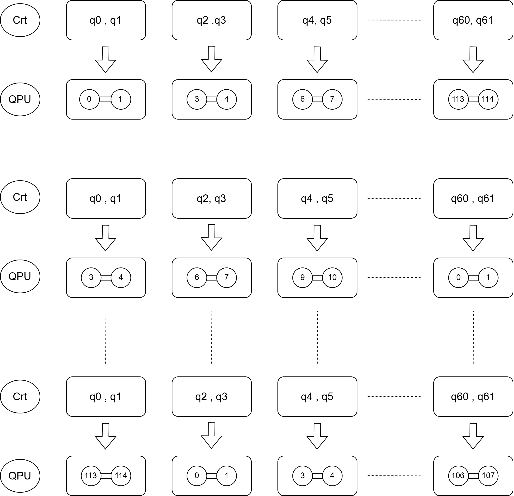
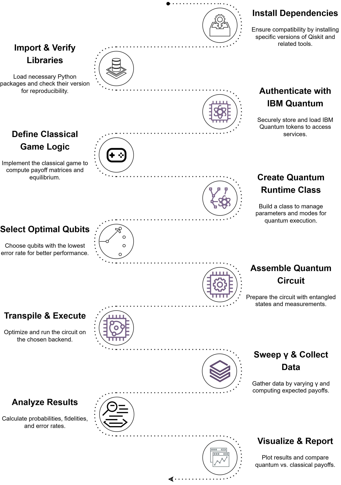

# GCM Strategy

## Experimental Quantum Battle of the Sexes (EQBSCQ)

A repository for implementing and comparing the classical and quantum versions of the **Battle of the Sexes** game under the Eisert–Wilkens–Lewenstein (EWL) scheme, highlighting the **Guided Circuit Mapping Strategy (GCM\_Strategy)** to mitigate errors on NISQ hardware.

---

## Description

**EQBSCQ** experimentally validates the Battle of the Sexes game in two modes:

1. **Classical:** computation of the mixed Nash equilibrium for Alice and Bob as a baseline.
2. **Quantum:** implementation of the EWL scheme with:

   * Ideal simulation (Qiskit–Aer).
   * Noisy simulation (IBM device noise model).
   * Real QPU execution on IBM Quantum.

We explore 31 values of the entanglement parameter γ ∈ \[0, π], comparing theoretical, simulated, and hardware payoffs. The **GCM\_Strategy** dynamically assigns qubit pairs to minimize interference and improve fidelity on NISQ devices.

---

## Requirements

* Python ≥ 3.8
* Qiskit == 2.0.1
* Qiskit-Aer == 0.17.0
* Qiskit-IBM-Runtime == 0.39.0
* NumPy, Matplotlib, NetworkX, Pandas, Tabulate
* IBM Quantum Runtime account and token

---

## Installation

```bash
# (Optional) Create and activate virtual environment
env_name="eqbscq_venv"
python -m venv $env_name
source $env_name/bin/activate  # Linux/macOS
# or
# $env_name\Scripts\activate  # Windows

# Install dependencies
pip install -U -c https://qisk.it/1-0-constraints \
    qiskit==2.0.1 \
    qiskit-aer==0.17.0 \
    qiskit-ibm-runtime==0.39.0 \
    numpy matplotlib networkx pandas tabulate
```

---

## Usage

### 1. Local Simulation (Aer)

```bash
python src/utils/parameter_sweep.py \
  --script src/quantum_runtime.py \
  --gamma_values 0.0 0.1 ... 3.14 \
  --shots 2048
```

### 2. Noisy Simulation

```bash
python src/utils/parameter_sweep.py \
  --script src/quantum_runtime.py \
  --gamma_values 0.0 0.1 ... 3.14 \
  --shots 2048 \
  --noise depolarizing
```

### 3. Hardware Execution with GCM

```bash
python src/gcm_strategy/execute_qpu.py \
  --backend ibm_sherbrooke \
  --gamma_values 0.0 0.1 ... 3.14 \
  --shots 2048 \
  --repetitions 5 \
  --use_gcm
```

---

## Methodology

This experimental pipeline follows a mixed analytical and practical approach divided into six main phases:

1. **Classical BoS Model**

   * Formulate the classical game and compute the **mixed Nash equilibrium** using optimal strategy probabilities.
   * Define the **payoff functions** for Alice and Bob.

2. **Quantum Formulation**

   * Introduce the entangled state |ψ(γ)⟩ with amplitudes depending on γ.
   * Define four local quantum strategies: Identity (I), Hadamard (H), Ry(π/4), and Ry(π).

3. **Circuit Construction in Qiskit**

   * Generate 31 γ values × 4 strategies = 124 circuits.
   * Compile and optimize circuits using the `sabre` layout and optimization level 3.

4. **Guided Circuit Mapping (GCM\_Strategy)**

   * Dynamically select 31 pairs of physically connected qubits, spaced uniformly to avoid crosstalk.
   * Perform noise-aware routing and iterative mapping adjustments based on previous run data to minimize errors.

   

5. **Execution on IBM QPU (ibm\_sherbrooke)**

   * Submit 31 circuits in parallel, using 62 qubits of the Eagle r3 processor.
   * Execute five repetitions per γ and record execution times.

6. **Validation & Analysis**

   * Collect marginal counts for states |00⟩, |01⟩, |10⟩, |11⟩.
   * Compute distributed averages, variances, and standard deviations per execution group.
   * Derive actual payoffs and uncertainties via error propagation.
   * Compare with analytical baselines to assess fidelity and quantify deviations.



---

## Results & Visualization

* Jupyter notebooks in `notebooks/` contain scripts to generate plots:

  * Payoff vs γ (simulation, noise, hardware).
  * Miscoordination and variance vs γ.
  * Absolute error histograms.

---

## Contributions

Contributions are welcome:

* Enhancing the **GCM\_Strategy** or adding new error mitigation schemes.
* Extending to other quantum games or QPU architectures.
* Integrating with error-correction frameworks.

---

## License

This project is licensed under the **MIT License**. See `LICENSE` for details.
